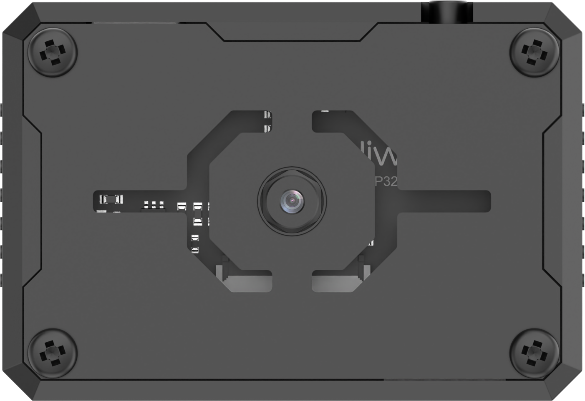
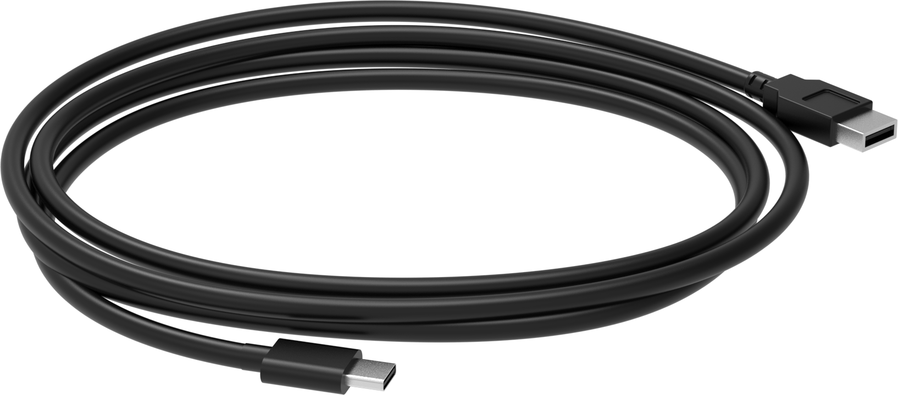
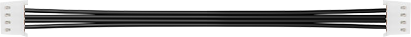
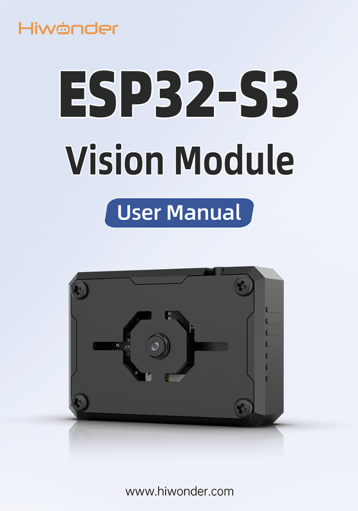
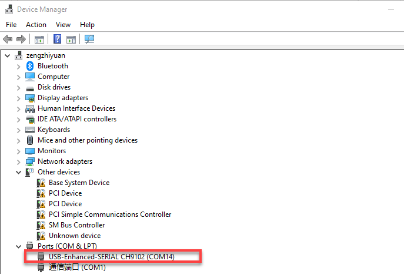
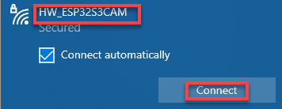
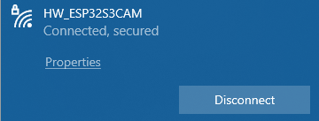
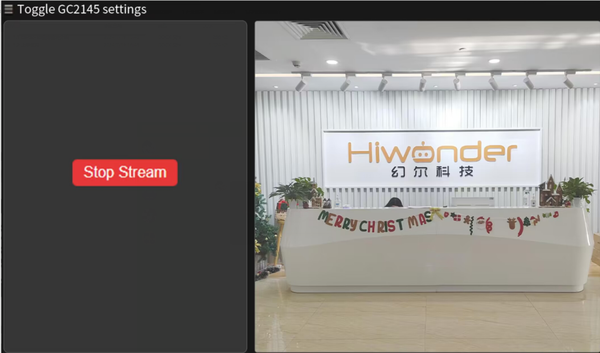

# 1. Product Introduction

## 1.1 Introduction to ESP32-S3 Vision Module

**1.1.1 Introduction & Working Principle**

The ESP32-S3 vision module is a compact camera module that can operate as a minimal standalone system.

It captures images using a built-in camera module, processes the image data with an ESP32 microcontroller, and transmits the data wirelessly via a Wi-Fi module. Supporting various communication protocols and featuring low power consumption, it is extensively used in a variety of IoT applications.

**1.1.2 Port Layout**

|  **Port Name**  |                   **Function Description**                   |
| :-------------: | :----------------------------------------------------------: |
| USB serial port |     Used for serial communication and firmware flashing      |
|  Custom button  |            Customize the button event in the code            |
|    IIC port     | It is the port for performing secondary development and connecting with the main controller. |

**1.1.3 Notice**

Please ensure that the module input power is at least 5V 2A, otherwise, the image may display watermarks.

The module comes with the firmware, which supports camera feedback functionality. If the vision recognition features are required, you need to flash the corresponding firmware

**1.1.4 Specific Technical Parameters**

For the detailed information, please refer to the EPS32-S3 technical parameters in [Chip Materials & Technical Parameters]().

## 1.2 Packing List

| **No.** | **Components**         | **Quantity** | **Picture**                                                |
| ------- | ---------------------- | ------------ | ---------------------------------------------------------- |
| 1       | ESP32-S3 Vision Module | 1            |  |
| 2       | USB Cable              | 1            |  |
| 3       | 4PIN Wire              | 1            |  |
| 4       | user manual            | 1            |  |

## 1.3 Getting Started

**1.3.1 Reminder**

(1) Please ensure that the module input power has a rated current greater than 2A. Otherwise, the image may display watermarks.

(2) The robot has pre-flashed firmware for video transmission functions, allowing users to quickly experience it. If other functionalities are required, different firmware will need to be flashed.

**1.3.2 Device Connection**

(1) Using a Type-C cable to connect the visual module to your computer. (Check in the Device Manager to ensure the port is connected properly)

:::{Note}

If the device cannot be found in the port, it may be because the computer does not have the necessary drivers installed. You can find the installation package in the path [Appendix->ch34xdriver (Window environment)](Appendix.md) and install it.

:::

(2) Connect to the hotspot generated by the module: HW_ESP32S3CAM.

The above connection procedure is for AP direct connection mode. The visual module also supports STA local network mode. For information and operational steps related to these modes, refer to "[Extended Lesson]()."

**1.3.3 Real-time Video Transmission Implementation**

After typing “**192.168.5.1**” in the browser’s address bar, press Enter and click  in the opened page to access the live feed camera interface.

