# 3. Image Recognition Course

## 3.1 Image Transmission

This section will introduce you how connect to the WIFI generated by `ESP32-S3` camera, log in to the fixed URL to view the live image transmission.

:::{Note}
If you’re failing to perform this functionality or have downloaded other firmwares for other functions, it is necessary to re-flash the firmware for image transmission.

Firmware download method can refer to [3.1.2 Flash Firmware (Optional)]() section in this document.
:::

### 3.1.1 Connect to ESP32S3 Camera

* **Connection Mode Introduction**

The `ESP32S3` camera module supports the following two network modes:

(1) AP Direct Connection Mode: the development board can create a hotspot that a mobile phone can connect to. (However, it cannot access the external internet.)

(2) STA (Station) Mode: The development board can actively connect to a specified hotspot/Wi-Fi network. (Internet access is available.)

Using AP direct connection mode is simpler and more convenient, so we recommend users start by learning how to configure and use this mode to get familiar with the basic functions. The STA mode can be explored later based on specific needs.

Additionally, no matter whether the user chooses AP mode or STA mode, the available features and functions remain the same.

* **AP Direct Connection Mode (Must read!)**

(1) Connect the module to your computer using a Type-C cable. (Check in Device Manager to ensure the ports are connected properly.)

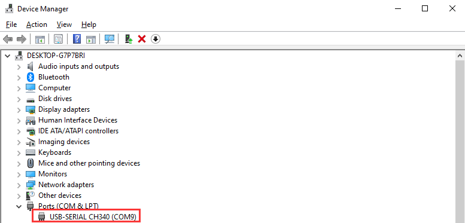

:::{Note}
If the device cannot be found in Port, it may be because the driver is not installed on your computer. You can find the installation package in the path [Appendix->ch34x Driver (Windows Environment)]() and install it manually.
:::

(2) Connect to the hotspot generated by the module: HW_ESP32S3CAM.

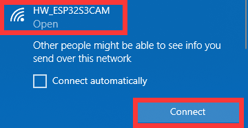

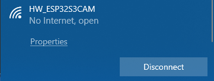

(3) Once connected, in the browser's address bar (both mobile and PC browsers can be used; we'll use the PC as an example), enter `"192.168.5.1"` and press Enter. On the opened page, click on  to turn on the live image transmission.

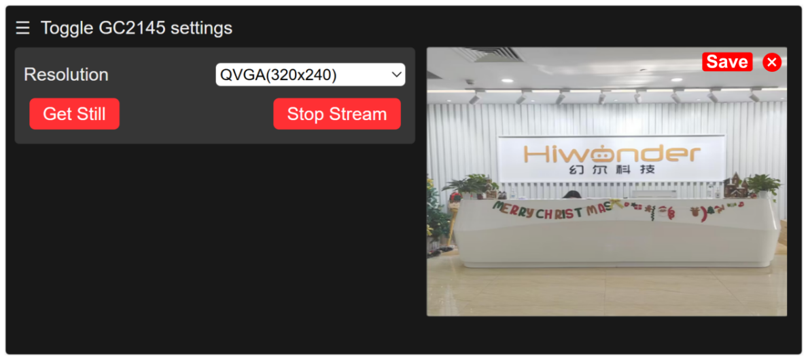

* **STA Mode Connection (Optional)**

(1) Turn on the mobile hotspot and configure the SSID name to `"HiwonderESP"` and the password to `"hiwonder"`.

:::{Note}
The SSID name and password must match exactly as shown here, or the device will fail to connect.
:::

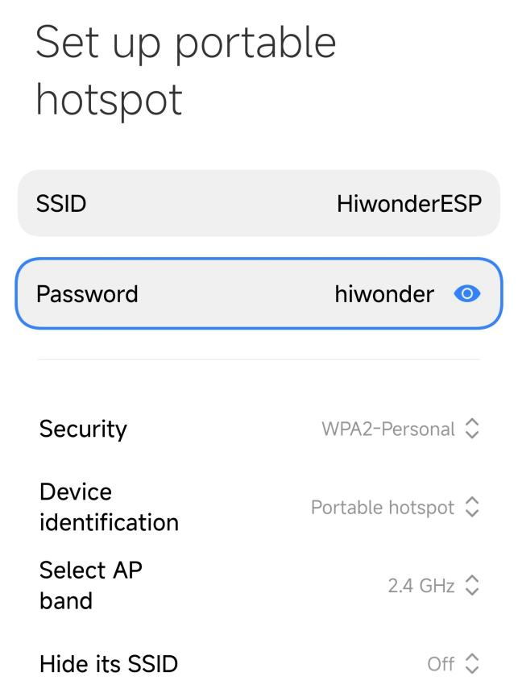

(2) Use a Type-C data cable to connect the camera to your computer. After a short moment, the camera will automatically connect to the mobile hotspot.

(3) After the network is successfully connected, open the Serial Debugging Tool from the path: [Appendix->Serial Debugging Tool](), then select the correct COM port and set the baud rate to `115200` to begin communication.

(4) Select the correct COM port (COM3 is used as an example here; the port number may vary). Set the baud rate to `115200`.

:::{Note}
Do not select `COM1`, as it is reserved for system communication.
:::

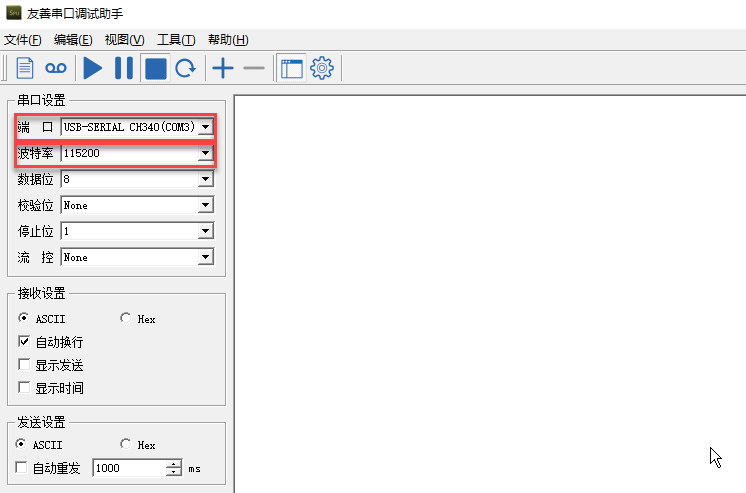

(5) Click the button  in the top-left corner of the interface to open `"UART Assistant"`. Then press the `"RST"` button on the `ESP32-S3` camera board. Scroll down to the last line in the serial output, and you will see the camera’s IP address, such as `192.168.197.226`.

:::{Note}
The IP address may vary—please refer to the actual address displayed.
:::

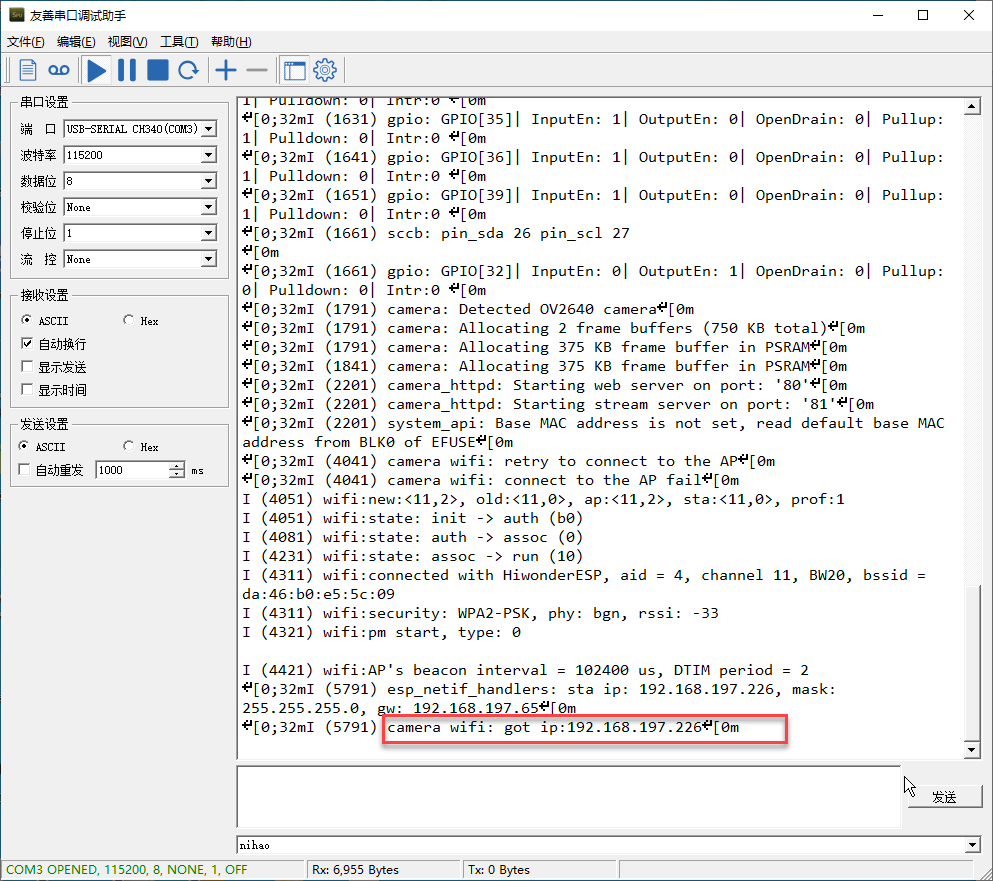

(6) At this point, disconnect the Type-C data cable and connect your computer to the same hotspot as the camera.

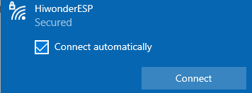

(7) In your browser’s address bar, enter the camera’s IP address (e.g., `192.168.197.226`) to access the video stream interface.

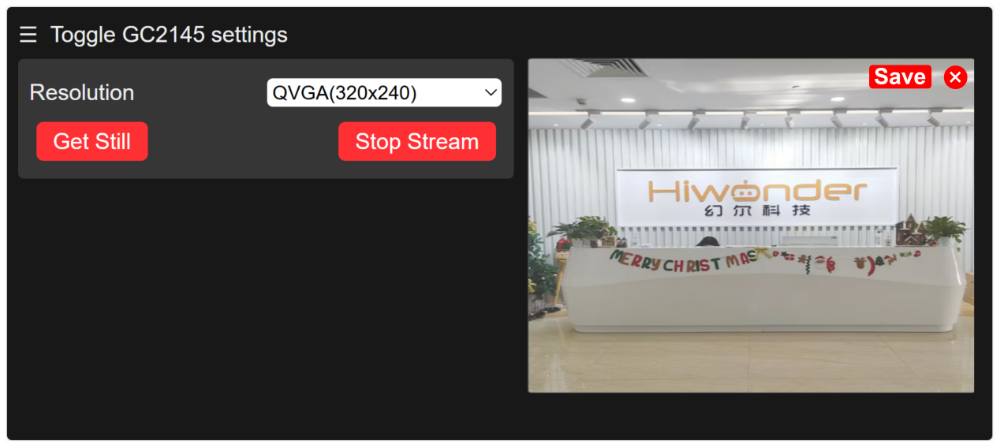

### 3.1.2 Flash Firmware (Optional)

(1) Locate and open the “flash_download_tool_3.9.7” stored in [Appendix->ESP32-S3 Firmware Flashing Tool->flash_download_tool_3.9.7.]().

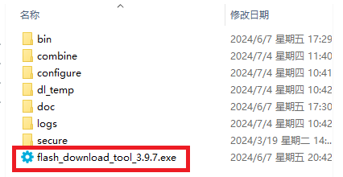

(2) Select Chip Type as `ESP32-S3`, and keep other settings as default, and then click `“OK”`.

(3) After opening the tool, click **"..."** to select the bin file of the program you need to flash. Below is an example using the image transmission function firmware:

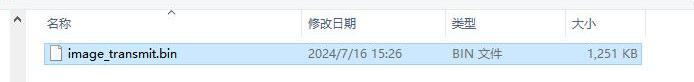

(4) Make sure to check the box on the left. Configure the remaining settings as shown in the image below, and select the `COM` port number corresponding to the port used by the vision module.

:::{Note}
If you set the `SPI MODE` to `DIO` as shown in the figure, the module may not function properly after flashing the firmware. Please try setting the `SPI MODE` to `DOUT` and flash again.
:::

(5) Click `“ERASE”` to wipe the underlying firmware (Do not skip this step), then click `“Start”` to begin flashing the new firmware. Wait for the flashing to complete.

## 3.2 Face Recognition

### 3.2.1 Flash Face Recognition Firmware
[Source Code]()

(1) Use a Type-C cable to connect the `ESP32S3` to the USB port of your computer.

(2) Locate and open the program file.

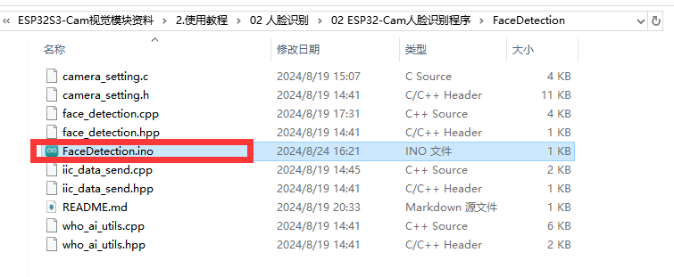

(3) Choose the `“ESP32S3 Dev Module”` for the development board.

(4) Click on the `“Tool”` menu and select the corresponding `ESP32S3` board configuration as shown in the image below.

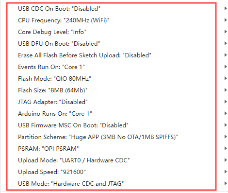

(5) Click on  to download the code to the `ESP32S3` module. Wait for the flashing to complete.

### 3.2.2 Project Performance

(1) Please ensure that one end of the Type-C cable to the `ESP32S3` module and the another end is connected to the USB port on your computer.

(2) Open the serial debugging tool located in the [5. Appendix->2. Serial Debugging Tool]().

(3) Select the port. Following will take `“COM9”` port as example (the port number is not unique, if `COM1` appears, do not select it as it is the system communication port). Set the baud rate to `“115200”`.

(4) Click on  in the top left corner of the page to open `"UART Assistant"`. Press the `"RST"` button on `ESP32` the board. Once the `ESP32` camera detects a face, it will print the coordinates of the face to the serial output.

For example:

If you receive data like `"center_x:103, center_y:114, width:185, length:247,"`, it means a face has been detected. Here, `center_x` and `center_y` represent the coordinates of the top-left corner of the face box, while `width` and `length` represent the width and height of the face box, with all units measured in pixels.

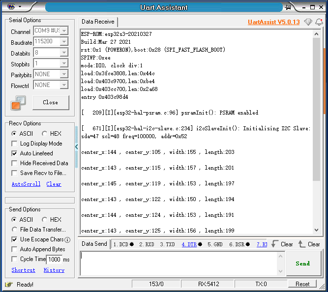

## 3.3 Color Recognition

### 3.3.1 Flash Color Recognition Firmware
[Source Code]()

(1) Use a Type-C cable to connect the `ESP32S3` to the USB port of your computer.

(2) Locate and open the program file.

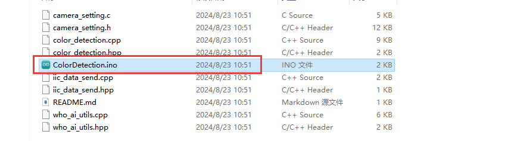

(3) Choose the **“ESP32S3 Dev Module”** for the development board.

(4) Click on the **“Tool”** menu and select the corresponding `ESP32S3` board configuration as shown in the image below.

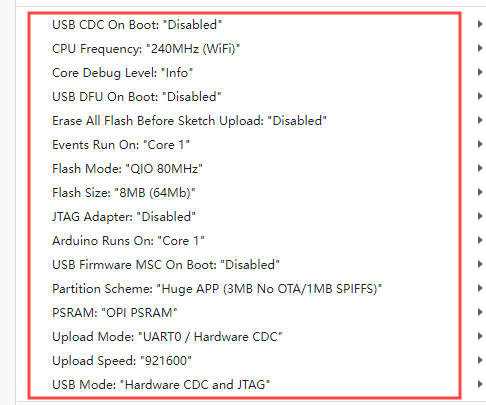

(5) Click on the `“Tool”` menu and select the corresponding `ESP32S3` board configuration as shown in the image below.

### 3.3.2 Project Performance

(1) Please ensure that one end of the Type-C cable to the `ESP32S3` module and the another end is connected to the USB port on your computer.

(2) Open the serial debugging tool located in the [Appendix->Serial Debugging Tool]().

(3) Select the port. Following will take `“COM11”` port as example (the port number is not unique, if `COM1` appears, do not select it as it is the system communication port). Set the baud rate to `“115200”`.

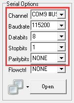

(4) Click on  in the top left corner of the page to open `"UART Assistant"`. Press the `"RST"` button on `ESP32` the board. Once the `ESP32` camera detects the preset color, it will print the currently recognized `HSV` color index to the serial output.

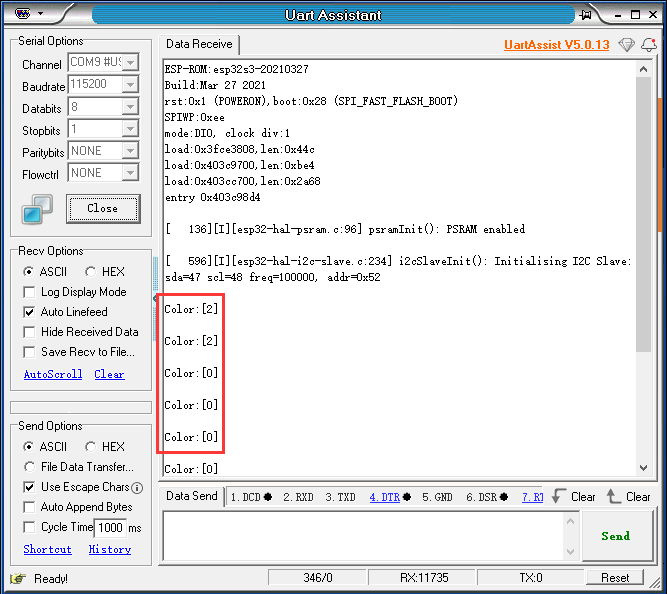

For instance,

If receiving `“color[0]”`, it indicates the `HSV` color value for red has been detected.

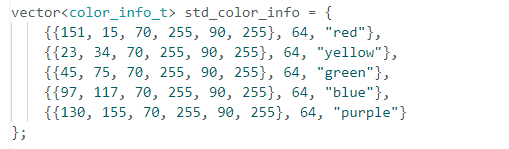

### 3.3.3 Modify Recognition Color

Following will change the recognition color to yellow as example. The specific modification steps can be referenced as follows:

(1) Firstly, open the `“HSV.exe”` program file located in [Appendix-> Color Recognition Routine & Tool->HSV->HSV.dist->HSV.exe]().

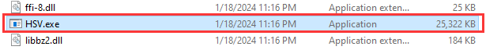

(2) Click the img file to choose the image file that you want to import. (The imported image needs to be stored in the "img" folder.)

(3) You can perform `HSV` threshold segmentation on the image by adjust the slider bar highlighted in the red box. Adjust it to a suitable `HSV` threshold range, referring to the color range table below for guidance.

| **NO.** | **Actions** | **NO.** | **Actions** |
|:---:|:---:|:---:|:---:|
| 1 | Stand: stand() | 10 | Sit：sit() |
| 2 | Move a step forward: forward() | 11 | kick_ball_left/right() |
| 3 | Move backward: Step backwards: back() | 12 | Dance: moonwalk() |
| 4 | Turn left: turn_left() | 13 | Lie down: lie_down() |
| 5 | Turn right: turn_right() | 14 | Have a good stretch: temp() |
| 6 | Box: boxing() | 15 | Bow: bow() |
| 7 | Push up: push_up() | 16 | Kick red ball: kick_ball('red') |
| 8 | Handshake: shake_hands() | 17 | Trace red line: visual_patrol('red') |
| 9 | Nod: nod() |||

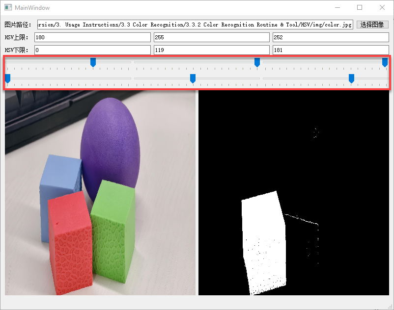

(4) Next, save the `HSV` threshold values. Open the file located in [Color Recognition Routine and Tool->ColorDetection->color_detection.cpp](). Modify the color data by replacing it with the saved `HSV` array. After that, follow [3.3.1 Flash Color Recognition Firmware]() to upload the modified program to the `ESPS3S2` module.

:::{Note}
Please ensure that the format of the array elements is correct and that they are comma-separated.
:::

(5) After the program is flashed successfully, the `ESP32S3-Cam` will be able to recognize objects of other colors.