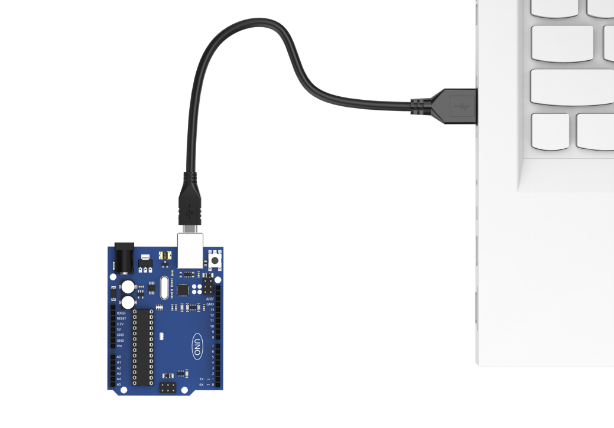
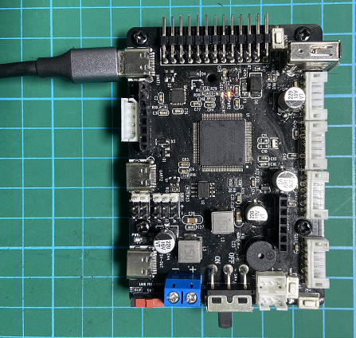
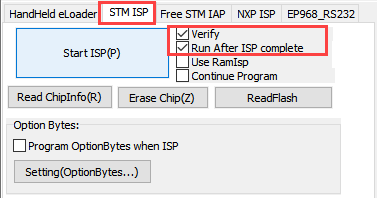

# 4.Communicate with Other Controllers

## 4.1 Master-Slave Communication

### 4.1.1 Preface

This section will introduce you to the detailed information about the master-slave relationship when the ESP32S3 communicates with different devices (such as Arduino and ESP32 controller). It explains how the ESP32S3 functions as a slave device communicating with other devices and how these devices act as masters to access and control data from the ESP32S3.

The ESP32S3 involved in this chapter serves as the slave device, transmitting information to other devices via I2C protocol.

### 4.1.2 Master-Slave Relationship

In the master-slave control system, the ESP32S3 functions as a slave device, while other microcontrollers function as the master.

* **Function of ESP32S as a Slave**

(1) Receiving and Parsing the signals sent by the master:

Waiting for an I2C signal interrupt. If I2C data is received, call the corresponding function based on the register address information received from I2C data.

(2) Data Processing and Feedback:

When the ESP32S3 receives a read register command, it needs to call the corresponding send function to transmit the recognized data to the master device.

When ESP32S3 receives a set register command, it sets the brightness of the fill light.

* **Other Devices as the Master**

(1) Sending Command:

The master needs to send the control data for the fill light to the ESP32S3-Cam.

(2) Controlling coordinate:

The master needs to manage the coordination of the entire system, ensuring there are no conflicts in communication and operation between the master, ESP32S3, and other devices connected to the master.

(3) Receiving data:

When the master reads data, after sending the read command, it needs to receive the status information data sent by the ESP32S3, parse the data packet, and extract the useful information from it.

### 4.1.3 Device Address And Register

When ESP32S3 is used for face recognition functionality:

| **Address** | **Function** |
|:--:|:--:|
| 0x52 (device address) | ESP32S3 communication address |
| 0x01 (register address) | Read face data int16_t x,y,w,h (When no face is recognized, all data is 0.) |

When ESP32S3-Cam is used for color recognition functionality:

| **Address** | **Function** |
|:--:|:--:|
| 0x52 (device address) | ESP32S3 communication address |
| 0x00 (register address) | Read color 0 data. The data format retrieved is int16_t x,y,w,h (when no recognition occurs, all data is 0). |
| 0x01 (register address) | Read color 1 data. The data format retrieved is int16_t x,y,w,h(when no recognition occurs, all data is 0). |

:::{Note}

* The x,y,w and h values in the table represents the color block detection frame identified by the module in the original image:

  ① x-coordinate of the center point 

  ② y-coordinate of the center point 

  ③ Width of the detection frame 

  ④ Height of the detection frame

  All parameters are in pixels. For details on the pixel coordinate system used in this mode, please refer to [4.1.4 Module Coordinate System Description]()."

* If multiple color blocks matching the preset color thresholds appear in the frame, the module will select the two largest ones based on their size in the image and store their detection frame data in register addresses 0x00 and 0x01, respectively.

:::

### 4.1.4 Module Coordinate System Description

This section provides a brief overview of the image coordinate system used by the camera while module operates under different functions. Users should be familiar yourselves with this before studying the sample routines. 

In the progress of porting the routines for secondary development, users should also refer to this document to establish the mapping between the module’s image coordinate system and he real-world spatial coordinate system. 

**Special attentions for the module’s image system coordinate are outline below:Special attentions for the module’s image system coordinate are outline below:**

① The origin is not at the center of the screen but at the top-left corner.

② The Y-axis direction is opposite to that of the conventional Cartesian coordinate system.

* **Image Transmission Mode**


:::{Note}

The image transmission mode uses a resolution of 320×240 to accommodate the image data interface of our mobile app.

:::

* **Face Recognition Mode**


:::{Note}

To ensure the smooth image transmission, the face recognition mode uses a resolution of 240*240, which is the value determined through our internal test. 

:::

* **Color Recognition Mode**


:::{Note}

To ensure the smooth image transmission, the face recognition mode uses a resolution of 160*140, which is the value determined through our internal test. 

:::

### 4.1.5 Notices

The power supply for the master device and ESP32S3 can be different, but they must share a command ground to ensure stable communication levels.

## 4.2 Communicate with Arduino Controller

### 4.2.1 Face Recognition

In this lesson, ESP32S3 module recognizes faces and then sends the data to the Arduino controller via the I2C protocol.

* **Working Logic Flowchart**


* **ESP32S3 Development Board Module**


The ESP32S3 development module accommodates ESP32S3 chip and camera module. When inserting the module into the I2C communication port of the board, it is capable of the retrieval of the color and face data through IIC communication.

* **Working Principle**

ESP32S3 carries a camera module, which transfers the collected image data to the ESP32S3 chip through a serial port. The ESP32S3 chip can process the images and transmit them to other devices via IIC communication.

* **Sensor Wiring**

The connection between ESP32S3 module and Arduino UNO control board is illustrated as follows:


* **Download Arduino UNO Program**

(1) Locate and open the program file located in [Arduino Board Face Recognition Program\ Arduino_esp32cam_face\Arduino_esp32cam_face.ino]() under the same directory.


(2) Use a Type-B cable to connect Arduino to your computer.


(3) Click **"Select Development Board"** option. It automatically detects the current Arduino serial port, then click it to connect.


(4) Click on  to download the program into Arduino board.


* **Flash ESP32-S3 Face Recognition Firmware**

(1) Connect one end of Type-C cable to the ESP32S3-Cam module, and the other end is connected to the USB port on your computer.

(2) Locate and open the program file [ESP32-S3 Face Recognition Routine\\ FaceDetection\\ FaceDetection.ino]().


(3) Next, select **"ESP32S3 Dev Module"** as the development board.


(4) Click on the **"Tool"** menu and select the corresponding ESP32S3 development board configuration as shown in the image below.


(5) And click on  to download the code to the ESP32S3 Dev module. Wait for the flashing to complete.


* **Outcome**

(1) When EPS32S3 recognizes no face, it will print **"face 0"** in the terminal monitor.


(2) When ESP32S3 detects a face, it will print **"find face"** and **"face 1"** in the terminal monitor.


* **Program Analysis**

[Source Code]()

(1) Initialize Program

① First, import the communication library required for the ESP32S3 routine.

{lineno-start=1}

```python
#include "hw_esp32cam_ctl.h" //Import ESP32Cam communication library(导入ESP32Cam通讯库)
```

② Next, create an ESP32S3 communication object for communication between Arduino UNO and ESP32S3.

{lineno-start=6}

```python
//ESP32Cam communication object (ESP32Cam通讯对象)
HW_ESP32Cam hw_cam;
```

③ In the `setup()` function, the main task is to initialize the related hardware devices. First, initialize the serial port, setting its communication baud rate to `115200` and the data read timeout to `500ms`. Next, initialize the communication with the ESP32S3.

{lineno-start=11}

```python
void setup() {
  Serial.begin(115200);
  // Set the timeout for serial port data reading (设置串行端口读取数据的超时时间)
  Serial.setTimeout(500);
  
  hw_cam.begin(); //Initialize the comminciation port with ESP32cam (初始化与ESP32Cam通讯接口)

  delay(500);
  Serial.println("start");
}
```

(2) Loop Calling Subfunctions

After initialization is complete, enter the main loop function, and repeatedly call the `espcam_task` function in sequence to perform face detection and execute the serial printing task.

{lineno-start=22}

```python
void loop() {
  // ESP32cam Communication Task (esp32cam通讯任务)
  espcam_task();
}
```

(3) ESP32S3 Communication Task

① First, define the `last_tick` variable to record the time of the last task execution; the `color` variable is used to store whether color data has been recognized. (`1` for yes, `1` for no.)

{lineno-start=29}

```python
  static uint32_t last_tick = 0;
  int res = 0;
```

② The `last_tick` variable is used in conjunction with `millis()` for delay operations. Specifically, the current running time of the program is obtained through the `millis()` function, and the difference with the `last_tick` variable is calculated. If the difference is less than `100`, the function exits; if it is greater than or equal to `100`, it means that `100ms` delay has occurred. Then, the current time is assigned to the `last_tick` variable for the next delay operation.

{lineno-start=32}

```python
  if (millis() - last_tick < 100) {
    return;
  }
  last_tick = millis();
```

③ Call the `faceDetect` function of `hw_cam` object to read the detected face data from the ESP32S3 module via I2C.

{lineno-start=37}

```python
  res = hw_cam.faceDetect();
```

{lineno-start=61}

```python
//Read ESP32Cam face detection (读取ESP32Cam检测人脸)
bool HW_ESP32Cam::faceDetect(void)
{
  uint8_t face_info[4];
  Serial.print("face ");
  int num = WireReadDataArray(0x01,face_info,4);
  if((num == 4) && (face_info[2] > 0)) //Retrieve the x,y,w and h values received of the detected face (接收识别到的人脸的x,y,w,h值)
  {
      Serial.println(" 1");
      return true;
  }
  Serial.println(" 0");
  return false;
}
```

④ Finally, determine whether face is currently recognized. If so, it prints **"find dace"** in the serial monitor.

{lineno-start=38}

```python
  if(res != 0)
  {
    Serial.println("find face");
  }
```

### 4.2.2 Color Recognition

In this lesson, ESP32S3 module will recognize the corresponding color and then sends the data to Arduino controller via the IIC protocol.

* **Working Logic Flowchart**


* **ESP32S3 Development Board Module**


The ESP32S3 development module accommodates ESP32 chip and camera module. When inserting the module into the I2C communication port of the board, it is capable of the retrieval of the color and face data through IIC communication.

* **Working Principle**

ESP32S3 carries a camera module, which transfers the collected image data to the ESP32S3 chip through a serial port. The ESP32S3 chip can process the images and transmit them to other devices via IIC communication.

* **Sensor Wiring**

The connection between ESP32S3 module and Arduino UNO control board is illustrated as follows:


* **Program Download**

(1) Locate and open the program file located in  [Arduino Color Recognition Program\\ Arduino_esp32cam_color\\ Arduino_esp32cam_color.ino.]()


(2) Use a Type-B cable to connect Arduino to your computer.



(3) Click **"Select Development Board"** option. It automatically detects the current Arduino serial port, then click it to connect.


(4) Click on  to download the program into Arduino board.


* **Download ESP32S3 Color Recognition Program**

(1) Connect one end of Type-C cable to the ESP32S3 module, and the other end is connected to the USB port on your computer.

(2) Locate and open the program file [ESP32S3 Color Recognition Program\\ ColorDetection\\ ColorDetection.ino]().


(3) Click on the **"Tool"** menu and select the corresponding ESP32S3 board configuration as shown in the image below.


(4) Next, select **"ESP32S3 Dev Module"** as the development board, and click on  to download the code to the ESP32S3-Cam module. Wait for the flashing to complete.


* **Outcome**

Open the serial tool  on the upper right corner of Arduino IDE, and then set the baud rate to `115200`.

(1) When ESP32S3 recognizes color 1, it will print **"COLOR_1"** in the serial monitor.


(2) When ESP32S3 recognizes color 2, it will print **"COLOR_2"** in the serial monitor.


* **Program Analysis**

[Source Code]()

(1) Initialize Program

① First, import the communication library required for the ESP32S3 program.

{lineno-start=1}

```python
#include "hw_esp32cam_ctl.h" //Import ESP32Cam communication library(导入ESP32Cam通讯库)
```

② Next, create an ESP32S3 communication object for communication between Arduino UNO and ESP32S3.

{lineno-start=6}

```python
//SP32Cam communication object (ESP32Cam通讯对象)
HW_ESP32Cam hw_cam;
```

③ In the `setup()` function, the main task is to initialize the related hardware devices. First, initialize the serial port, setting its communication baud rate to `115200` and the data read timeout to `500ms`. Next, initialize the communication with the ESP32S3, set the communication interface, and set the brightness of the EPS32S3’s fill light to `0`. (within the range of `0` to `255`, where `0` turns off the fill light).

{lineno-start=11}

```python
void setup() {
  Serial.begin(115200);
  //  Set the timeout for serial port data reading (设置串行端口读取数据的超时时间)
  Serial.setTimeout(500);
  
  hw_cam.begin(); //Initialize the comminciation port with ESP32cam (初始化与ESP32Cam通讯接口)
  
  delay(500);
  Serial.println("start");
}
```

(2) Loop Calling Subroutine

After initialization is complete, enter the main loop function, and repeatedly call the `espcam_task` function in sequence to perform face detection and execute the serial printing task.

{lineno-start=22}

```python
void loop() {
  // ESP32cam Communication Task (esp32cam通讯任务)
  espcam_task();
}
```

(3) ESP32S3 Communication Task

① First, define the `last_tick` variable to record the time of the last task execution; the `color` variable is used to store whether color data has been recognized. (`1` for yes, `1` for no.)

{lineno-start=29}

```python
  static uint32_t last_tick = 0;
  int color = 0;
```

② The `last_tick` variable is used in conjunction with `millis()` for delay operations. Specifically, the current running time of the program is obtained through the `millis()` function, and the difference with the `last_tick` variable is calculated. If the difference is less than `100`, the function exits; if it is greater than or equal to `100`, it means that `100ms` delay has occurred. Then, the current time is assigned to the `last_tick` variable for the next delay operation.

{lineno-start=32}

```python
  if (millis() - last_tick < 100) {
    return;
  }
  last_tick = millis();
```

③ Call the `colorDetect` function of `hw_cam` object to read the detected face data from the ESP32S3 module via I2C.

{lineno-start=37}

```python
  color = hw_cam.colorDetect(); //Retrieve current color data (获取颜色)
```

This function reads the color register data of the ESP32S3 via I2C, retrieving the values from two color registers separately. If all data are `0`, indicating no recognition, it returns `0`. When there is data for a box (indicating recognition of the corresponding color), it returns the corresponding value (`1` for color 1, `2` for color 2).

{lineno-start=77}

```python
int HW_ESP32Cam::colorDetect(void)
{
  uint8_t color_info[2][4];
  int num = WireReadDataArray(0x00,color_info[0],4);
  if((num == 4) && (color_info[0][2] > 0)) //Receive the x,y,w and h values of the recoginized color (接收识别到的颜色的x,y,w,h值)
  {
      return 1;
  }
  num = WireReadDataArray(0x01,color_info[1],4);
  if(num == 4)
  {
    if(color_info[1][2] > 0) //If the w value is greater than 0, color 1 is recogized (若w值大于0，则识别到颜色1)
    {
      return 2;
    }
  }
  return 0;
}
```

④ Finally, determine whether color is currently recognized. If so, it prints the corresponding label via serial communication (printing **"COLOR 1"** for color 1 and **"COLOR 2"** for color 2).

{lineno-start=37}

```python
  color = hw_cam.colorDetect(); //Retrieve current color data (获取颜色)
  if(color == COLOR_1)
  {
    Serial.println("COLOR 1");
  }else if(color == COLOR_2)
  {
    Serial.println("COLOR 2");
  }
}
```

## 4.3 Communicate with ESP32

### 4.3.1 Face Recognition Routine

In this lesson, ESP32-S3 module recognizes faces and then sends the data to the ESP32 controller via the I2C protocol.

* **Working Logic Flowchart**


* **ESP32-S3 Development Module**


The ESP32S3-Cam development module accommodates ESP32 chip and camera module. When inserting the module into the I2C communication port of the board, it is capable of the retrieval of the color and face data through IIC communication.

* **Working Principle**

ESP32-S3 vision module carries a camera module, which transfers the collected image data to the ESP32 chip through a serial port. The ESP32 chip can process the images and transmit them to other devices via IIC communication.

* **Sensor Wiring**

The connection between ESP32-S3 module and ESP32 control board is illustrated as follows:


* **Download ESP32 Program**

[Source code]()

(1) The development of this program is based on MicroPython. Locate and open the “**main.py**” program file in [ESP32 Board Face Recognition Routine/ FaceDetection]().


(2) Click on  to connect to ESP32 control board, and then click on  to download the program into the control board.


(3) The below prompt indicates the successful download. Short press the reset button on ESP32 control board to view the printed information.


* **Flash ESP32-S3 Face Recognition Firmware**

(1) Connect one end of Type-C cable to the ESP32S3-Cam module, and the other end is connected to the USB port on your computer.

(2) Locate and open the program file [ESP32-S3 Face Recognition Routine\\ FaceDetection\\ FaceDetection.ino]().


(3) Next, select **"ESP32S3 Dev Module"** as the development board.


(4) Click on the **"Tool"** menu and select the corresponding ESP32S3 development board configuration as shown in the image below.


(5) And click on  to download the code to the ESP32S3 Dev module. Wait for the flashing to complete.


* **Outcome**

When ESP32-S3 module detects a face, it will print **"find face"** in the serial monitor.


* **Program Analysis**

[Source Code]()

(1) Define ESP32-S3 Address

{lineno-start=9}

```python
ESP32CAM_ADDR = 0x52
ESP32CAM_FACE = 0x01
ESP32CAM_LED = 0x11
```

`ESP32CAM_ADDR` represents the device address, `ESP32CAM_FACE` represents the register address for face data, and `ESP32CAM_LED` represents the register address for LED control.

(2) Initialize IIC

{lineno-start=15}

```python
  iic = I2C(0, scl=Pin(23), sda=Pin(22), freq=100000)
  sleep_ms(1000)
```

(3) Loop Call Subroutine

{lineno-start=19}

```python
    rec = iic.readfrom_mem(ESP32CAM_ADDR , ESP32CAM_FACE , 8)
    if len(rec) >= 8:
      values = struct.unpack('<hhhh', rec)
      if values[2] > 0:
        print("find face")
        iic.readfrom_mem(ESP32CAM_ADDR , ESP32CAM_FACE , 8)
        sleep_ms(100)
    sleep_ms(100)
```

① If a face is recognized, it will print **"find face"** and clear data.

### 4.3.2 Color Recognition Routine

In this lesson, ESP32-S3 module recognizes the corresponding color and then sends the data to the ESP32 controller via the IIC protocol.

* **Working Logic Flowchart**


* **ESP32-S3 Development Module**


The ESP32-S3 development module accommodates ESP32 chip and camera module. When inserting the module into the I2C communication port of the board, it is capable of the retrieval of the color and face data through IIC communication.

* **Working Principle**

The ESP32-S3 carries a camera module, which transfers the collected image data to the ESP32 chip through a serial port. The ESP32 chip can process the images and transmit them to other devices via IIC communication.

* **Sensor Wiring**

The connection between ESP32-S3 vision module and ESP32 control board is illustrated as follows:


* **Download ESP32 Program**

[Souce code]()

(1) The development of this program is based on MicroPython. Locate and open the “**main.py**” program file in [ESP32 Board Color Recognition Routine/ main.py]().


(2) Click on  to connect to ESP32 control board, and then click on  to download the program into the control board.


(3) The below prompt indicates the successful download. Short press the reset button on ESP32 control board to view the printed information.


* **Download ESP32-S3 Color Recognition Program**

[Source code]()

(1) Connect one end of Type-C cable to the ESP32-S3 module, and the other end is connected to the USB port on your computer.

(2) Locate and open the program file [ESP32S3 Color Recognition Program\\ ColorDetection\\ ColorDetection.ino]().


(3) Next, select **"ESP32S3 Dev Module"** as the development board


(4)  Click on the **"Tool"** menu and select the corresponding ESP32S3 board configuration as shown in the image below.


(5) and click on  download the code to the ESP32S3-Cam module. Wait for the flashing to complete.


* **Outcome**

(1) When ESP32-S3 vision module recognizes Color 1, it will print **"COLOR_1"** in the serial monitor.


(2) When ESP32-S3 Cam recognizes Color 2, it will print **"COLOR_2"** in the serial monitor.


* **Program Analysis**

[Source Code]()

(1) Define ESP32-S3 Address

{lineno-start=9}

```python
ESP32CAM_ADDR = 0x52
ESP32CAM_COLOR_1 = 0x00
ESP32CAM_COLOR_2 = 0x01
ESP32CAM_LED = 0x11
```

"ESP32CAM_ADDR" represents the device address, "ESP32CAM_COLOR_1" represents the recognized color 1 data register address, "ESP32CAM_COLOR_2" represents the recognized color 2 data register address, "ESP32CAM_LED" the register address for LED control.

(2) Initialize IIC

{lineno-start=17}

```python
  iic = I2C(0, scl=Pin(23), sda=Pin(22), freq=100000)
  sleep_ms(1000)
```

(3) Loop Call Subroutine

{lineno-start=20}

```python
  while True:
    rec1 = iic.readfrom_mem(ESP32CAM_ADDR , ESP32CAM_COLOR_1 , 8) #Read color 1 (读取颜色1)
    sleep_ms(50)
    rec2 = iic.readfrom_mem(ESP32CAM_ADDR , ESP32CAM_COLOR_2 , 8) #Read color 2 (读取颜色2)
    if len(rec1) >= 4 and rec1[2] > 0:
        print("COLOR 1")
    elif len(rec2) >= 4 and rec2[2] > 0:
        print("COLOR 2")
    sleep_ms(500)
```

Read the register address data for Color1 and Color2 separately. If the return values are all zeros, it indicates that no color is recognized; if any return value is non-zero, it indicates that the corresponding color is recognized, and the corresponding string is printed.

## 4.4 Communicate with STM32

### 4.4.1 Face Recognition Routine

In this lesson, ESP32-S3 module recognizes faces and then sends the data to the ESP32 controller via the I2C protocol.

* **Working Logic Flowchart**


* **ESP32-S3 Development Module**


The ESP32-S3 development module accommodates ESP32 chip and camera module. When inserting the module into the I2C communication port of the board, it is capable of the retrieval of the color and face data through IIC communication.

* **Working Principle**

ESP32-S3 vision module carries a camera module, which transfers the collected image data to the ESP32 chip through a serial port. The ESP32 chip can process the images and transmit them to other devices via IIC communication.

* **Sensor Wiring**

The connection between ESP32-S3 module and STM32F407VET6 control board is illustrated as follows:


Please specially note: the STM32F407VET6 development board used in this routine is our specially designed ROS Robot Controller. For common I2C peripheral interactions, we have specifically routed out the I2C2 pin resources. You only need a 4-pin cable to connect the I2C interface of the development board to the I2C interface of the module.

If you are using a different development board, its design and layout may vary. In that case, simply use jumper wires to connect the module’s `5V` and `GND` lines to the corresponding pins on the main controller. Then connect the `SCL` and `SDA` lines to the `PB10` and `PB11` pins of the STM32F407VET6 development board. The functionality will remain the same.

* **STM32 Program Flashing**

[Source Code]()

(1) Use a Type-C cable to connect the STM32 main control board’s Type-C port (UART1) to the computer’s USB port.

:::{Note}

If you’re using your own development board, please refer to the manufacturer's hardware design for the download method. The method described here may not apply to your development board!!!

:::



<p style="text-align:center">[UART1]</p>

(2) Open the FluMcu software. In the menu bar at the top of the software, click **"Search Serial Port"**, then set the baud rate (bps) to **115200**.


Click on **"STMISP"** option in software interface.


(3) Click on  highlighted in the red box shown below, then select the hex file to be flashed.


(4) Return to the previous interface and click **"Start Programming"** to flash the hex file to the STM32 controller:


(5) Flashing is in progress:


(6) If the sidebar displays the following prompt, it indicates that flashing is complete.


* **Flash ESP32-S3 Face Recognition Firmware**

(1) Connect one end of Type-C cable to the ESP32S3-Cam module, and the other end is connected to the USB port on your computer.

(2) Locate and open the program file [ESP32-S3 Face Recognition Routine\\ FaceDetection\\ FaceDetection.ino]().


(3) Next, select **"ESP32S3 Dev Module"** as the development board.


(4) Click on the **"Tool"** menu and select the corresponding ESP32S3 development board configuration as shown in the image below.


(5) And click on  to download the code to the ESP32S3 Dev module. Wait for the flashing to complete.


* **Project Outcome**

When the ESP32-S3 detects a face, it will print **"find face"** on Serial Port `3` at a baud rate of `115200`.


* **Program Analysis**

[Source Code]()

(1) Define ESP32-S3 Address

{lineno-start=15}

```python
#define device_addr 0x52

#define face_data_reg_addr   0x01
```

"device_addr" represents the device address, "face_data_reg_addr" represents the register address for face data. The register will return `4` elements.

(2) Initialize IIC

{lineno-start=31}

```python
void MX_I2C2_Init(void)
{

  /* USER CODE BEGIN I2C2_Init 0 */

  /* USER CODE END I2C2_Init 0 */

  /* USER CODE BEGIN I2C2_Init 1 */

  /* USER CODE END I2C2_Init 1 */
  hi2c2.Instance = I2C2;
  hi2c2.Init.ClockSpeed = 100000;
  hi2c2.Init.DutyCycle = I2C_DUTYCYCLE_16_9;
  hi2c2.Init.OwnAddress1 = 0;
  hi2c2.Init.AddressingMode = I2C_ADDRESSINGMODE_7BIT;
  hi2c2.Init.DualAddressMode = I2C_DUALADDRESS_DISABLE;
  hi2c2.Init.OwnAddress2 = 0;
  hi2c2.Init.GeneralCallMode = I2C_GENERALCALL_DISABLE;
  hi2c2.Init.NoStretchMode = I2C_NOSTRETCH_DISABLE;
  if (HAL_I2C_Init(&hi2c2) != HAL_OK)
  {
    Error_Handler();
  }
  /* USER CODE BEGIN I2C2_Init 2 */

  /* USER CODE END I2C2_Init 2 */

}
```

(3) Loop Call Subroutine

{lineno-start=73}

```python
void esp32cam_face_data_get(){
	HAL_I2C_Mem_Read(&hi2c2, device_addr << 1 , face_data_reg_addr, I2C_MEMADD_SIZE_8BIT, cam1.face_detection ,4*sizeof(uint8_t), 0xFFFF);
	
	if(cam1.face_detection[0] != 0 && cam1.face_detection[1] != 0 && cam1.face_detection[2] != 0  && cam1.face_detection[3] != 0){
		const char *msg = "find face\n";
		HAL_UART_Transmit_DMA(&huart3, (uint8_t*)msg, strlen(msg));  
	}
}
```

If a face is recognized, it will print **"find face"** and clear data.

### 4.4.2 Color Recognition Routine

In this section, the ESP32-S3 vision module identifies the corresponding color, and then sends the data to the ESP32 controller via the I2C protocol.

* **Working Logic Flowchart**


* **ESP32-S3 Development Module**


The ESP32-S3 development module accommodates ESP32 chip and camera module. When inserting the module into the I2C communication port of the board, it is capable of the retrieval of the color and face data through IIC communication.

* **Working Principle**

ESP32-S3 vision module carries a camera module, which transfers the collected image data to the ESP32 chip through a serial port. The ESP32 chip can process the images and transmit them to other devices via IIC communication.

* **Sensor Wiring**

The connection between ESP32-S3 module and STM32F407VET6 control board is illustrated as follows:


Please specially note: the STM32F407VET6 development board used in this routine is our specially designed ROS Robot Controller. For common I2C peripheral interactions, we have specifically routed out the `I2C2` pin resources. You only need a `4-pin` cable to connect the I2C interface of the development board to the I2C interface of the module.

If you are using a different development board, its design and layout may vary. In that case, simply use jumper wires to connect the module’s `5V` and `GND` lines to the corresponding pins on the main controller. Then connect the `SCL` and `SDA` lines to the `PB10` and `PB11` pins of the STM32F407VET6 development board. The functionality will remain the same.

* **Program Download**

(1) Use a Type-C cable to connect the STM32 main control board’s Type-C port (`UART1`) to the computer’s USB port.

:::{Note}

If you’re using your own development board, please refer to the manufacturer's hardware design for the download method. The method described here may not apply to your development board!!!

:::


<p style="text-align:center">UART1</p>

(2) Open the `FluMcu` software. In the menu bar at the top of the software, click **"Search Serial Port"**, then set the baud rate (bps) to 115200.


Click on **"STMISP"** option in software interface.




(3) Click on  highlighted in the red box shown below, then select the hex file to be flashed.


(4) Return to the previous interface and click **"Start Programming"** to flash the hex file to the STM32 controller:


(5) Flashing is in progress:


(6) If the sidebar displays the following prompt, it indicates that flashing is complete.


* **Download ESP32-S3 Color Recognition Program**

(1) Connect one end of Type-C cable to the ESP32-S3 module, and the other end is connected to the USB port on your computer.

(2) Locate and open the program file [ESP32-S3 Color Recognition Routine\\ ColorDetection\\ColorDetection.ino]().


(3) Next, select **"ESP32S3 Dev Module"** as the development board.


(4) Click on the **"Tool"** menu and select the corresponding ESP32S3 development board configuration as shown in the image below.


(5) And click on  to download the code to the ESP32S3 Dev module. Wait for the flashing to complete.


* **Project Outcome**

(1) When ESP32-S3 vision module identifies Color 1, it will print **"COLOR_1"** in the serial monitor.


(2) When ESP32-S3 vision module recognizes Color 2, it will print **"COLOR_2"** in the serial monitor.


* **Program Analysis**

[Source Code]()

(1) Define ESP32-S3 Address

{lineno-start=15}

```python
#define device_addr 0x52 


#define face_data_reg_addr   0x01


#define color_data_reg_addr 0x00
```

"device_addr" represents the device address, "face_data_reg_addr" represents the register address for face data. The register will return `4` elements.

(2) Initialize IIC

{lineno-start=32}

```python
void MX_I2C2_Init(void)
{

  /* USER CODE BEGIN I2C2_Init 0 */

  /* USER CODE END I2C2_Init 0 */

  /* USER CODE BEGIN I2C2_Init 1 */

  /* USER CODE END I2C2_Init 1 */
  hi2c2.Instance = I2C2;
  hi2c2.Init.ClockSpeed = 100000;
  hi2c2.Init.DutyCycle = I2C_DUTYCYCLE_16_9;
  hi2c2.Init.OwnAddress1 = 0;
  hi2c2.Init.AddressingMode = I2C_ADDRESSINGMODE_7BIT;
  hi2c2.Init.DualAddressMode = I2C_DUALADDRESS_DISABLE;
  hi2c2.Init.OwnAddress2 = 0;
  hi2c2.Init.GeneralCallMode = I2C_GENERALCALL_DISABLE;
  hi2c2.Init.NoStretchMode = I2C_NOSTRETCH_DISABLE;
  if (HAL_I2C_Init(&hi2c2) != HAL_OK)
  {
    Error_Handler();
  }
  /* USER CODE BEGIN I2C2_Init 2 */

  /* USER CODE END I2C2_Init 2 */

}
```

(3) Loop Call Subroutine

{lineno-start=88}

```python
void esp32cam_color_data_get(uint8_t reg){
	HAL_I2C_Mem_Read(&hi2c2, device_addr << 1, reg, I2C_MEMADD_SIZE_8BIT, cam1.color_detection, 4*sizeof(uint8_t), 0xFFFF);
	if(reg == 0x04){
		if(cam1.color_detection[0] != 0){
			const char *msg = "COLOR 1\n";
			HAL_UART_Transmit_DMA(&huart3, (uint8_t*)msg, strlen(msg));  
		}
		if(cam1.color_detection[1] != 0){
			const char *msg = "COLOR 2\n";
			HAL_UART_Transmit_DMA(&huart3, (uint8_t*)msg, strlen(msg)); 
		}
		if(cam1.color_detection[2] != 0){
			const char *msg = "COLOR 3\n";
			HAL_UART_Transmit_DMA(&huart3, (uint8_t*)msg, strlen(msg));  
		}
		if(cam1.color_detection[3] != 0){
			const char *msg = "COLOR 4\n";
			HAL_UART_Transmit_DMA(&huart3, (uint8_t*)msg, strlen(msg));  
		}
	}else{
		HAL_UART_Transmit_DMA(&huart3, cam1.color_detection, 4);  
	}
```

① Read the address of register that stores all color data. If all returned values are **"0"**, it indicates that no color data has been detected. If any returned value is not `0`, it indicates that a corresponding color has been detected, and the corresponding string will be printed.

## 4.5 Communicate with Raspberry Pi

### 4.5.1 Face Recognition Routine

In this lesson, ESP32-S3 module recognizes faces and then sends the data to the ESP32 controller via the I2C protocol.

* **Working Logic Flowchart**


* **ESP32-S3 Development Module**


The ESP32-S3 development module accommodates ESP32 chip and camera module. When inserting the module into the I2C communication port of the board, it is capable of the retrieval of the color and face data through IIC communication.

* **Working Principle**

ESP32-S3 vision module carries a camera module, which transfers the collected image data to the ESP32 chip through a serial port. The ESP32 chip can process the images and transmit them to other devices via IIC communication.

* **Sensor Wiring**

The connection between ESP32-S3 module and Raspberry Pi controller is illustrated as follows:


* **Program Download**

(1) Power on Raspberry Pi, and connect it from your PC using `VNC` software or another remote access method.

(2) Upload the “**main.py**” program file from the same folder as this document to any directory on Raspberry Pi using `SSH` or another file transfer method.


(3) Click **"Tools-> Open Current Folder in Terminal"** in sequence to open the command link in the current directory.


(4) Enter the following command to run the program:

```
python main.py
```

* **Flash ESP32-S3 Face Recognition Firmware**

(1) Connect one end of Type-C cable to the ESP32S3-Cam module, and the other end is connected to the USB port on your computer.

(2) Locate and open the program file [ESP32-S3 Face Recognition Routine\\ FaceDetection\\ FaceDetection.ino]().


(3) Next, select **"ESP32S3 Dev Module"** as the development board.


(4) Click on the **"Tool"** menu and select the corresponding ESP32S3 development board configuration as shown in the image below.


(5) And click on  to download the code to the ESP32S3 Dev module. Wait for the flashing to complete.


* **Project Outcome**

When the ESP32-S3 module detects a face, it will print **"find face"** in the command line.


* **Program Analysis**

[Source Code]()

(1) Define ESP32-S3 Address

{lineno-start=19}

```python
ESP32CAM_ADDR = 0x52

# When ESP32-Cam is used for face recognition: (当ESP32-Cam为人脸识别功能时:)
face_data_reg_addr = 0x01  # Face recognition register address（人脸识别寄存器地址）
'''
     data[0] : center_x
		 data[1] : center_y
		 data[2] : detection_width
		 data[3] : detection_length
'''
```

"device_addr" represents the device address, "face_data_reg_addr" represents the register address for face data. The register will return `4` elements.

(2) Initialize IIC

{lineno-start=48}

```python
bus = smbus.SMBus(I2C_BUS)
```

(3) Loop Call Subroutine

{lineno-start=50}

```python
def face_data_get():
  rec = bytes(bus.read_i2c_block_data(ESP32CAM_ADDR , face_data_reg_addr, 4)) 
  # Send a data request to the slave device at address ESP32CAM_ADDR, requesting data from the register at face_data_reg_addr (向从机发出数据请求，请求传送总线地址ESP32CAM_ADDR的从机地址(face_data_reg_addr)的寄存器内的数据)
  if len(rec) >= 4:
    values = struct.unpack('<BBBB', rec) # B stands for unsigned char (B 代表无符号字符)(unsigned char)
    if(values[0] != 0 and values[1] != 0 and values[2] != 0 and values[3] != 0):
      print("find face")
  time.sleep(0.1) 
```

If a face is recognized, it will print **"find face"** and clear data.

### 4.5.2 Color Recognition Routine

In this section, the ESP32-S3 vision module identifies the corresponding color, and then sends the data to the ESP32 controller via the I2C protocol.

* **Working Logic Flowchart**


* **ESP32-S3 Development Module**


The ESP32-S3 development module accommodates ESP32 chip and camera module. When inserting the module into the I2C communication port of the board, it is capable of the retrieval of the color and face data through IIC communication.

* **Working Principle**

The ESP32-S3 carries a camera module, which transfers the collected image data to the ESP32 chip through a serial port. The ESP32 chip can process the images and transmit them to other devices via IIC communication.

* **Sensor Wiring**

The connection between ESP32-S3 vision module and Raspberry Pi controller is illustrated as follows:


* **Program Download**

(1) Power on Raspberry Pi, and connect it from your PC using `VNC` software or another remote access method.

(2) Upload the “**main.py**” program file from the same folder as this document to any directory on Raspberry Pi using `SSH` or another file transfer method.


(3) Click **"Tools-> Open Current Folder in Terminal"** in sequence to open the command link in the current directory.


(4) Enter the following command to run the program:

```
python main.py
```

* **Download ESP32-S3 Color Recognition Program**

(1) Connect one end of Type-C cable to the ESP32-S3 module, and the other end is connected to the USB port on your computer.

(2) Locate and open the program file [ESP32-S3 Color Recognition Routine\\ ColorDetection\\ColorDetection.ino]().


(3) Next, select **"ESP32S3 Dev Module"** as the development board.


(4) Click on the **"Tool"** menu and select the corresponding ESP32S3 development board configuration as shown in the image below.


(5) And click on  to download the code to the ESP32S3 Dev module. Wait for the flashing to complete.


* **Project Outcome**

(1) When ESP32-S3 vision module identifies Color 1, it will print **"COLOR_1"** in the serial monitor.


(2) When ESP32-S3 vision module recognizes Color 2, it will print **"COLOR_2"** in the serial monitor.


* **Program Analysis**

[Source Code]()

(1) Define ESP32-S3 Address

{lineno-start=20}

```python
ESP32CAM_ADDR = 0x52

# When ESP32-Cam is used for face recognition: (当ESP32-Cam为人脸识别功能时:)
face_data_reg_addr = 0x01  #（ace recognition register address（人脸识别寄存器地址）
'''
     data[0] : center_x
		 data[1] : center_y
		 data[2] : detection_width
		 data[3] : detection_length
'''
```

"device_addr" represents the device address, "face_data_reg_addr" represents the register address for face data. The register will return `4` elements.

(2) Initialize IIC

{lineno-start=49}

```python
bus = smbus.SMBus(I2C_BUS)
```

(3) Loop Call Subroutine

{lineno-start=61}

```python
def color_data_get(reg):
  rec = bytes(bus.read_i2c_block_data(ESP32CAM_ADDR , reg, 4))
  if len(rec) >= 4:
    values = struct.unpack('<BBBB', rec)
    if reg == 0x04:
      if values[0] != 0:
        print('COLOR 1')
      if values[1] != 0:
        print('COLOR 2')
      if values[2] != 0:
        print('COLOR 3')
      if values[3] != 0:
        print('COLOR 4')
    else:
      print(values)
  time.sleep(0.1) 
```

Read the address of register that stores all color data. If all returned values are **"0"**, it indicates that no color data has been detected. If any returned value is not `0`, it indicates that a corresponding color has been detected, and the corresponding string will be printed.